# README

___

## Description  

```TipOutApp``` is designed to streamline and automate the tip-out process for restuarants that operate in a pooled house environment. In the includes database management, report generation, and report distribution. Specifically, ```TipOutApp``` will take the (user defined) total tips accrued during a shift, subtract a (user defined) percentage of the total for the hosts, compute the host and server hourly, and compute the individual wages for each employee (host, sever) based on the number of hours he/she worked.
___

## Additonal Functionality

Employee Database: ```employee_information_database.csv```

* ```TipOutApp``` manages a basic a employee database that contains:
  * First name
  * Last name
  * Email address
* This database is generated the first time an employee is added to it.
* Employees can be added and removed.  
  
Employee Earnings Database: ```employee_earnings_database.csv```
  * ```TipOutApp``` manages a basic a employee earnings database that contains:
    * First name
    * Last name
    * Pay
    * Hours
    * Position (host or server)
    * Shift (lunch or dinner)
    * Date
  * This database is generated the first time shift data is added to it.
  * It is updated by a button press for every shift.

Generate Daily Reports:
* This summary report (PDF) is generated at the end of every shift with the press of a button. It contains all earnings information relavent to the current shift.

Generate Weekly Reports:
* This report (PDF) contain employee earnings information over defined period. The period is defined by user input (start date, end date), and the data is queried using ```pandas``` from the ```employee_earnings_database.csv```.
* It is designed to aid in payroll.

Distribute Daily Reports:
* All daily reports can be automattically emailed to all shift-employees with the press of a button. 
* This is designed for transparency.
* This functionality requires a ```gmail``` account and a 16 character Google generated App Password (see Google API).

___

## Usage Instructions:

### Step 1: Open ```TipOutApp```  

This is the first window that opens when the app is opened.  

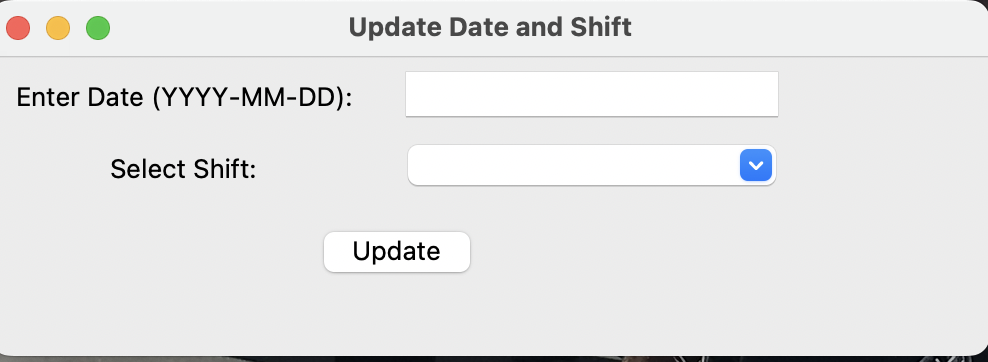 

The user must enter the basic shift information. This information will used to populate the ```employee_earnings_databse.csv``` and it will used in the file name for the *daily* report.

### Step 2: Setup

If this is the first time ```TipOutApp``` is being used the user must click to ```Modify Employee Database```

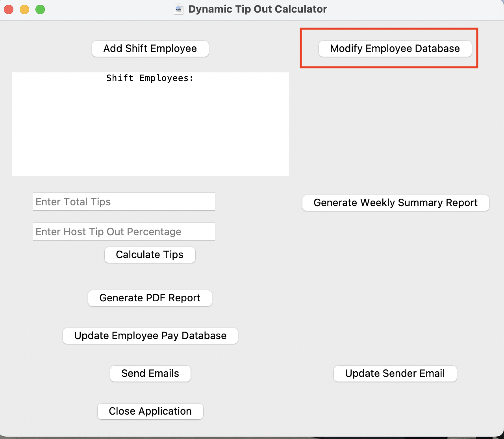


### Step 3: Add Emplyees to Employee Database

From this page the user can add and remove employees from the employee database. No two employees can have the same email address, and email address is used to identify and remove the employees.

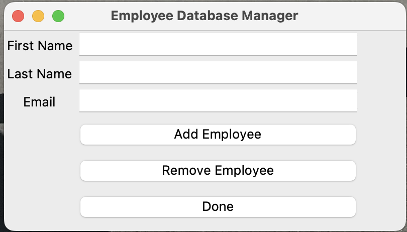

### Step 4: Update Sender Email  

Also on the first usage the user must update the sender email by clicking ```Update Sender Email```

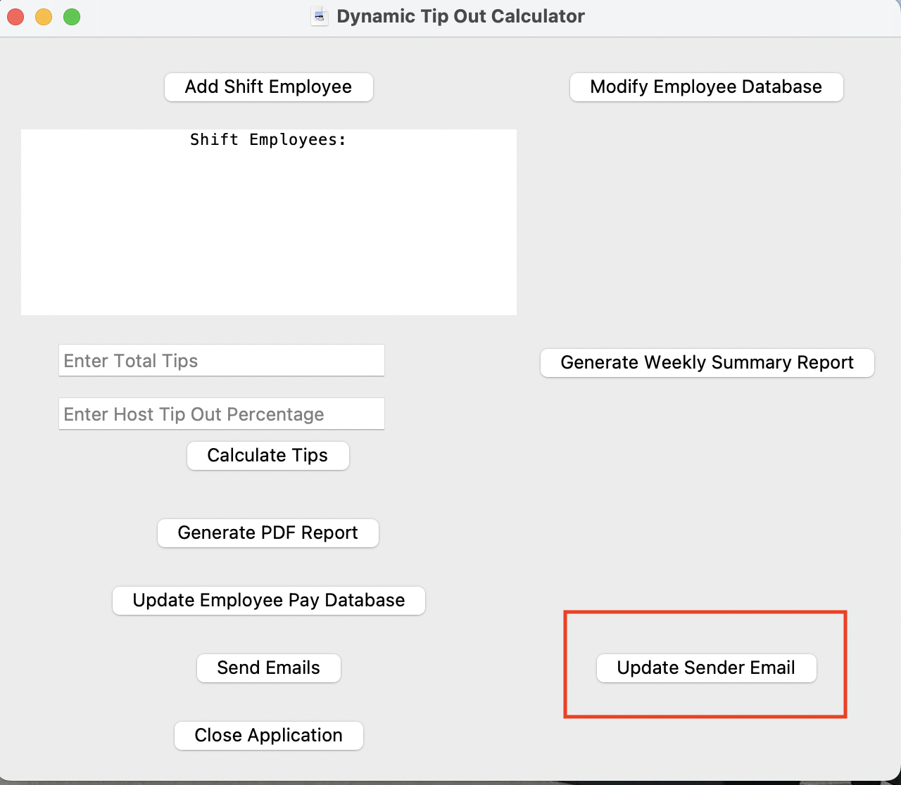

### Step 4: Add Email Information

From this windown the user can update the sender email. This is the email address that will send the *daily* report to all shift employees. This must be a ```gmail``` account and the password must the 16 character password generated from Google API under App Passwords.

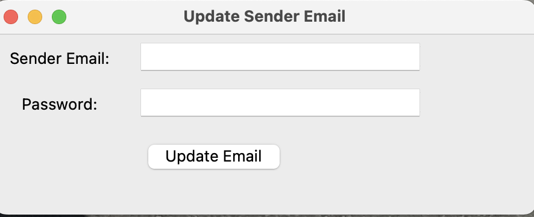

### Step 5: Setup Shift

Once setup is complete, the user can add shift employee and perform comutations. By clicking ```Add Shift Emplyee```.  

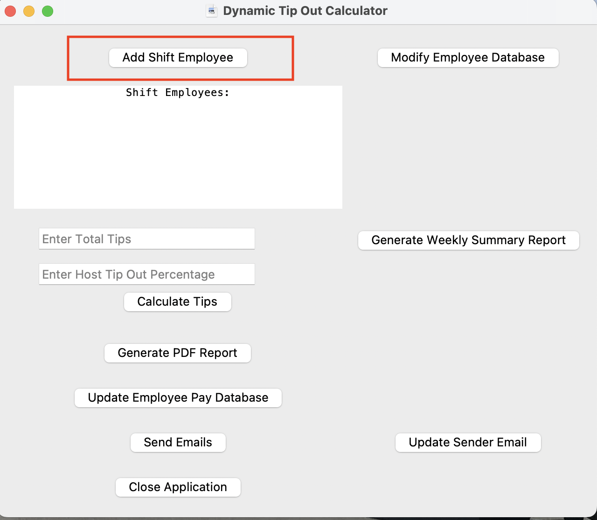

### Step 6: Add Shift Employee

From this window, employees from the employee database can be added to the shift.

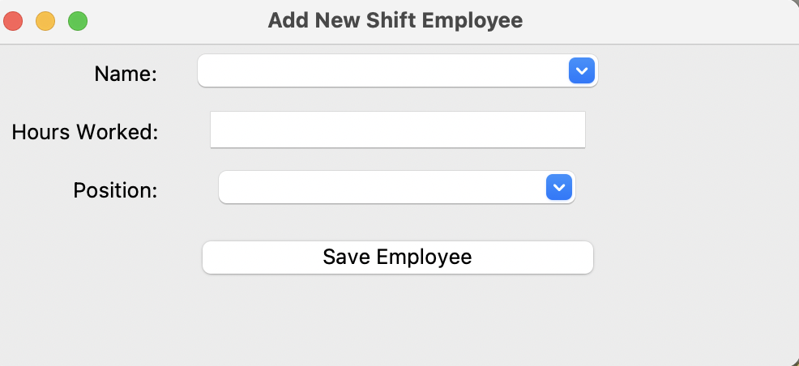

Employees are identified as added in the ```Shift Employees``` box.

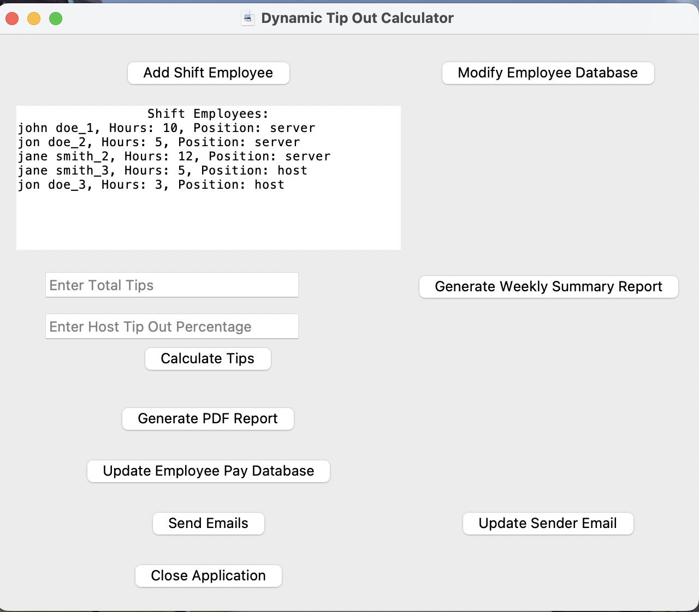

### Step 7: Calcualte Tips

After all shift employees have been added, the user can press ```Calculate Tips```. The results are displayed beneath the button.

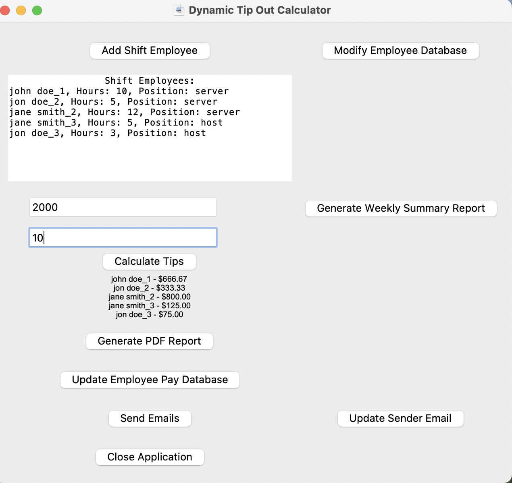

### Step 8: Generate Daily Summary Report (PDF)

Next, the user can generate a summary report PDF by clicking ```Generate PDF Report```. This report will be automatically saved in the ```../reports/daily/``` folder.

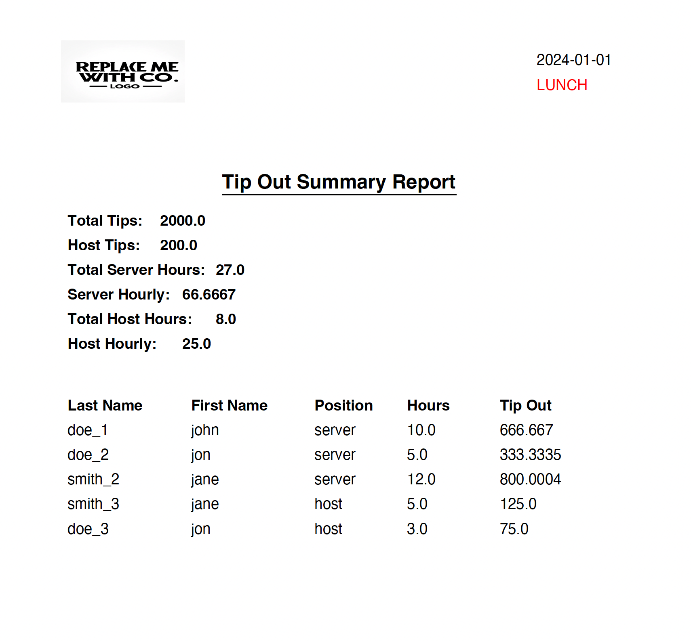

### Step 9: Send Emails

To send the *daily* report via email to all shift employees the user needs to click ```Send Emails```.

### Step 10: Generate Weekly Earnings Report

If the user wants to generate a weekly summary report the user may press ```Generate Weekly Summary Report```.

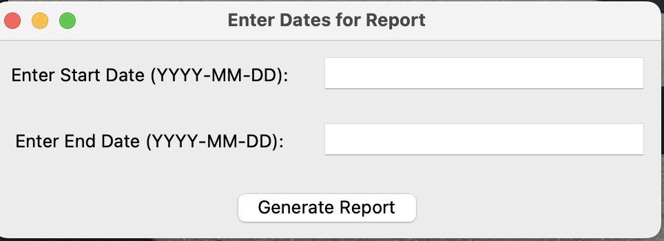

After entering the date range the user must press ```Generate Report```.  This report will be automatically saved in the ```../reports/weekly/``` folder.

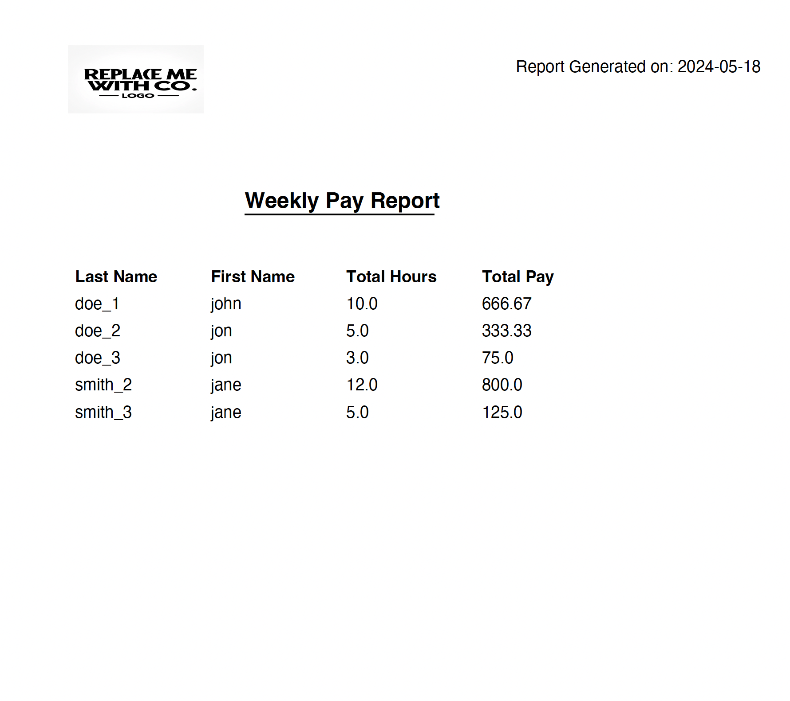


